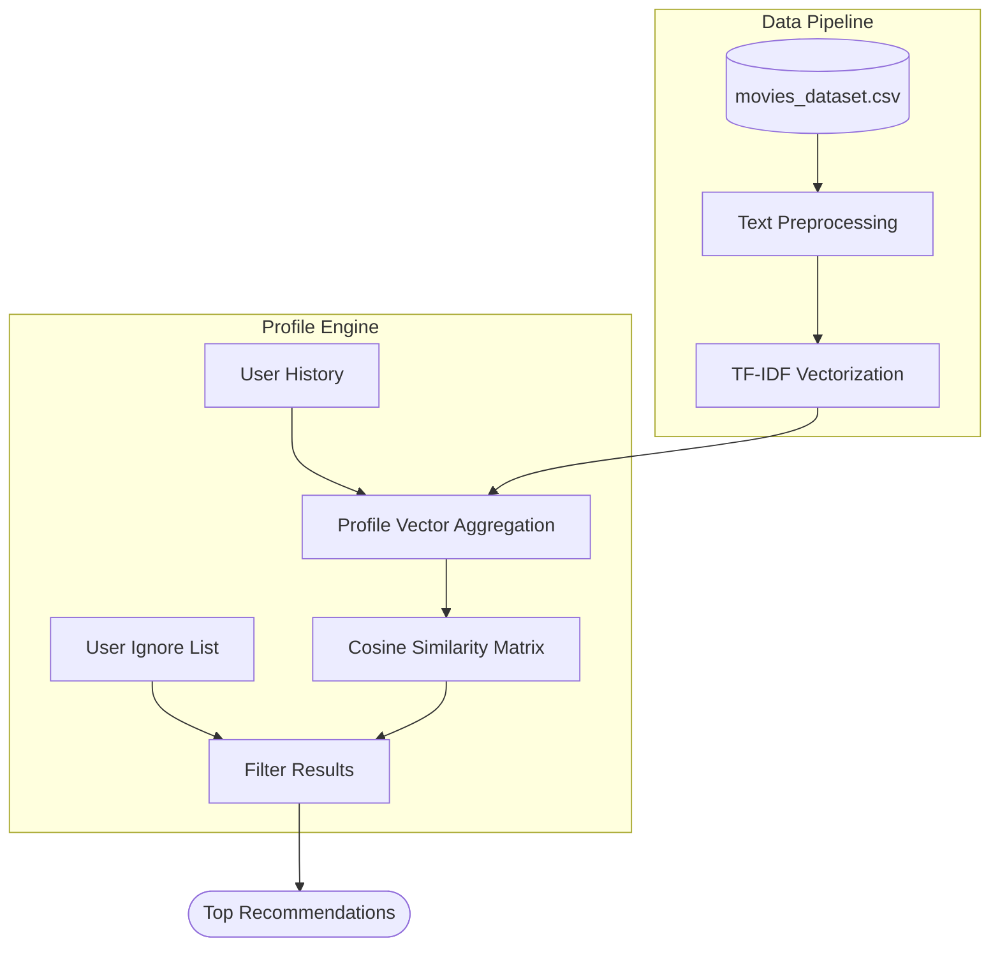
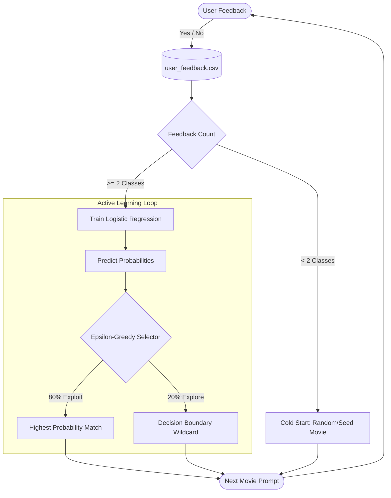

# Hybrid Machine Learning Movie Recommender (CLI Experiment)

**A personal experiment applying Software QA practices to Machine Learning.**

This is a hybrid (offline-first + TMDB API fallback) recommendation engine built with TF-IDF Vectorization and Cosine Similarity. It includes two modes:

- **Profile-based recommendations** — Build a persistent user profile and get weighted suggestions.
- **'Tinder for movies' (Active Learning)** — Interactive session with Epsilon-Greedy exploration to avoid echo chambers.

**Goal of the project:** Test how QA techniques (edge-case hunting, data validation, risk identification, iterative refinement, bias mitigation, and regression testing) apply when building and evolving an ML system from scratch.

**Tech Stack:** Python, scikit-learn, pandas, TMDB API, Pytest

## System Architecture

### 1. Profile-Based Recommendations
The profile engine uses a standard Content-Based filtering approach, relying on TF-IDF (Term Frequency-Inverse Document Frequency) to map out the textual similarity between movies based on their genres, keywords, and plot overviews.



### 2. Active Learning ('Tinder Mode')
The active learning engine builds a personalized Logistic Regression classifier in real-time. It balances *exploitation* (showing you movies it knows you'll like) with *exploration* (showing you wildcards to discover new niches).



### Key Features
- Offline dataset (4,000+ movies) for speed and privacy, with seamless live API fallback
- Max Pooling + Genre Boosting + Review Score weighting
- Franchise auto-detection with preview
- Epsilon-Greedy active learning (exploration vs exploitation)
- Robust handling of real-world data messiness (remakes, foreign films, vocabulary mismatch, missing data)
- Parameterised and randomised Pytest suites for validation

### Quick Start

1. Clone the repo
2. `pip install -r requirements.txt`
3. Copy `.env.example` to `.env` and add your TMDB API key (optional — works fully offline)
4. Run one of the mains:
   - `python main_profile.py` → Profile mode
   - `python main_active.py` → Active learning / Tinder-style mode

**Note:** A pre-built `movies_dataset.csv` is included so you can try it immediately without an API key.

### Running the Tests

```bash
# Install dependencies (if not already done)
pip install -r requirements.txt

# Run all tests
pytest

# Run with verbose output + coverage
pytest -v --cov=.

# Run specific test files
pytest tests/test_data_validation.py -v
pytest tests/test_recommendation.py -v
pytest tests/test_active_learning.py -v

# Run with random ordering (great for spotting flaky edge cases)
pytest --randomly-seed=42
```

**Key Test Suites:**
- `test_data_validation.py` — Data quality & ingestion checks
- `test_recommendation.py` — Core similarity logic, edge cases & bias checks
- `test_active_learning.py` — Epsilon-Greedy and user profile behaviour

All tests run fully offline using the included `movies_dataset.csv`.

## QA Challenges & Solutions Applied
I used this project to deliberately apply structured QA thinking to ML development. Key issues identified and resolved:

### Data Quality & Ingestion
- **Ingestion Firewall** — Dropped invalid entries (blank overviews, non-Latin titles) early.
- **Dynamic CSV Alignment** — Fixed column shifting when extending the dataset.
- **Release Year Backfill & Disambiguation** — Better handling of remakes with identical titles.
- Expanded dataset from 1k to 4k+ movies while maintaining quality.

### Recommendation Logic
- Switched to Max Pooling + Genre Boosting to prevent popular franchises from diluting rare keywords.
- Added Review Score Multiplier and Foreign Film Handicap to reduce bias.
- Integrated TMDB community keywords to bridge vocabulary mismatch.
- Introduced controlled randomness ("Discovery Temperature") for varied recommendations.

### Active Learning & UX
- Epsilon-Greedy Exploration (20% rate) to prevent echo chambers.
- Franchise Previews and Execution vs Taste split for better user control.
- Online Search Override for remakes and Hard Reset for cold starts.

Additional regression fixes and details are in the commit history.

## Testing Approach
- Chose movies because of strong domain knowledge → rapid oracle-based testing.
- Added parameterised + randomised Pytest suites for validation.
- Next step: Design a testing strategy usable by non-domain experts.

## Status
Experimental / Rapid prototype (started ~1 week ago). The focus has been on applying QA rigour rather than building a polished consumer product.

Feel free to explore the code and tests. Feedback welcome!
